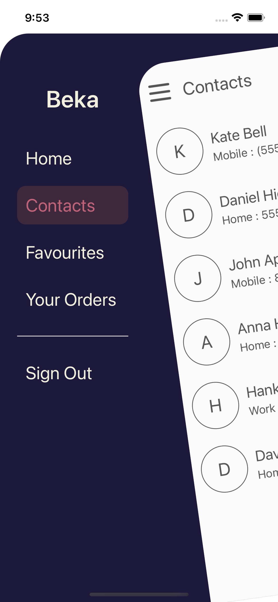
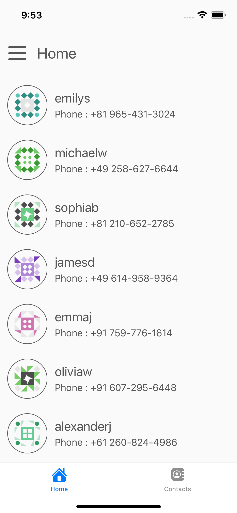
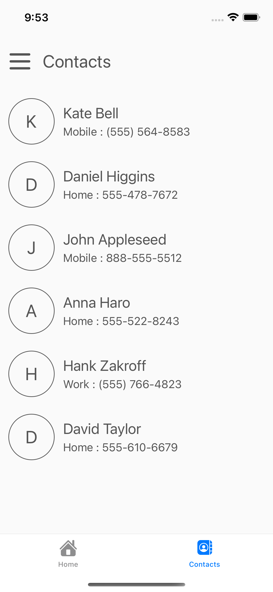
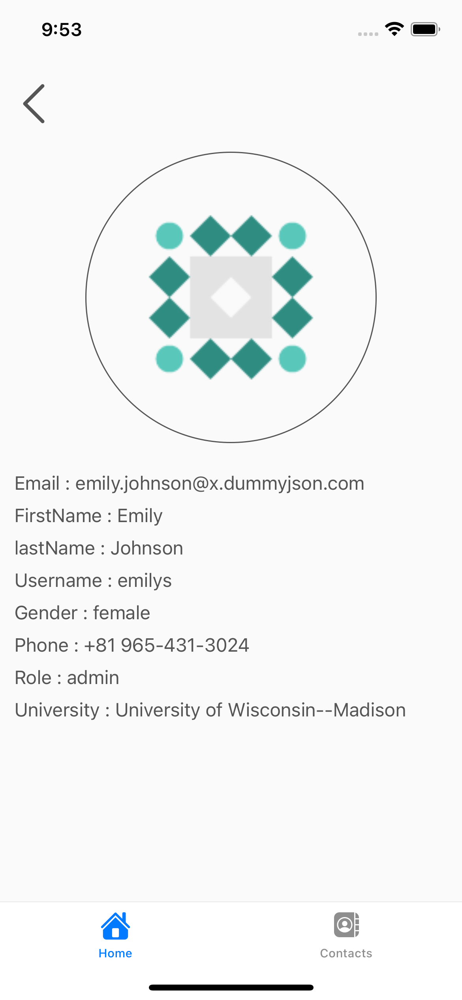

## Project Overview

<p align="center">
  <a>
    
  </a>
  <h1 align="center">Gerald App</h1>  
</p>

This project involves building a **drawer menu** with nested navigation patterns using React Native and TypeScript. The goal is to replicate the drawer functionality shown in the provided GIF while incorporating additional navigation features such as a **bottom tab navigator** and **stack navigators** for individual screens.

The solution also demonstrates the use of **React Native Reanimated** to enhance performance and animation quality.

---

## :camera_flash: Screenshots

<div align="center" style="margin:auto;width:100%;display:flex;justify-content:center;align-items:center;flex-wrap:wrap;">




</div>

---

### Demo

<br>
<div style="text-align: center;">
<video src="https://github.com/user-attachments/assets/63f47d1d-0277-4d01-acec-5be779205873" controls="controls" height="720px" margin="auto" >
  Your browser does not support the video tag.
</video>
</div>
<br>

---


## Features

1. **Drawer Menu**:
   - A custom drawer menu similar to the provided GIF.
   - Acts as the parent navigation component.
2. **Tab Navigator**:
   - Includes bottom tabs for navigating between major sections.
   - Tabs:
     - **Home** (with nested stack screens: `Screen1` and `Screen2`)
     - **Contact**
3. **Stack Navigator**:

   - Nested inside the `Home` tab, enabling navigation between `Screen1` and `Screen2`.

4. **Animations**:
   - Smooth transitions and interactions using [React Native Reanimated](https://github.com/software-mansion/react-native-reanimated).

---

## Project Structure

```
root
   └── android
   └── ios
   └── patches
   └── src
         ├── assets
         │     ├── components
         │     └── svgs
         ├── components
         ├── constants
         ├── navigation
         ├── screens
         ├── types
         └── utils
```

---

## Installation and Setup

Follow these steps to set up and run the project locally:

1. **Install Dependencies**:

   ```bash
   npm install
   # or
   yarn install
   ```

2. **Run the Application**:

   - For iOS:
     ```bash
     npx react-native run-ios
     ```
   - For Android:
     ```bash
     npx react-native run-android
     ```

---

## Thought Process

1. **Component Hierarchy**:

   - Structured navigation using React Navigation to ensure modularity and scalability.
   - Drawer serves as the parent component for the tab navigator and subsequent child screens.

2. **TypeScript Integration**:

   - Used TypeScript for type safety and better development experience.
   - Ensured strong typing for props and navigation objects.

3. **UI Similarity**:

   - Replicated the drawer menu design as closely as possible to the provided GIF.
   - Included a polished UI for the drawer content and screens.

4. **Performance Enhancements**:

   - Leveraged React Native Reanimated for smooth and efficient animations.
   - Ensured seamless transitions between drawer and child navigators.

5. **Flexibility**:
   - Created a reusable structure for adding or modifying screens in the future.


